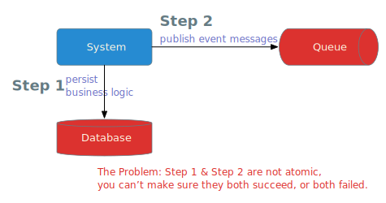
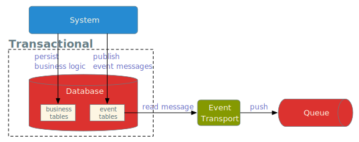
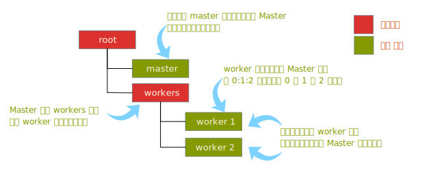
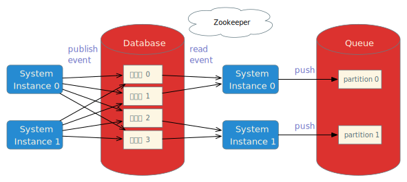
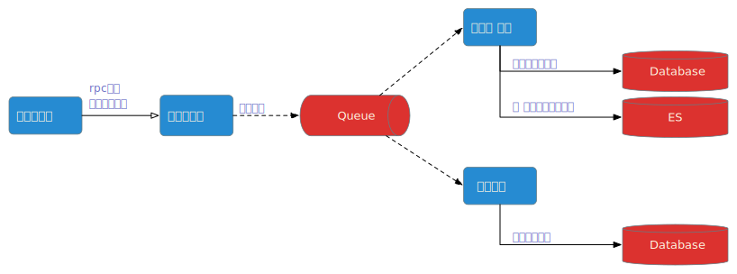

## 背景

事件驱动是一种灵活的系统设计方法，在事件驱动的系统中，当数据发生变化时系统会产生、发布一个对应的事件，其它对这个事件感兴趣的部分会接收到通知，并进行相应的处理。事件驱动设计最大的好处在我看来有两点：一是它为系统提供了很好的扩展能力，比如我们可以对某类事件增加一个订阅者来对系统进行扩展，最主要的是我们并不需要修改任何已有的代码，它完全符合开闭原则；二是它实现了模块间的低偶合，系统间各个部分不是强依赖关系，而是通过事件把整个系统串联起来。

很多系统都通过消息队列作为事件的中介来实现事件的发布与订阅，类似这样的代码：

```java
@Transactional(readOnly = false, isolation = Isolation.READ_COMMITTED, rollbackFor = Exception.class)
@Override
public void changePhoneNumber(String newNumber) {
    userDao.updatePhone(this.getUserId(), newNumber); // 本地数据库修改

    // 发布 用户手机号码变更 事件
    Event event = new Event(...); // 创建一个事件对象，表示用户修改手机号码
    ProducerRecord record = new ProducerRecord(...event); // 根据event生成kakfa record

    Future<RecordMetadata> f = kafkaProducer.send(record);
    try {
        f.get();
    } catch (InterruptedException | ExecutionException e) {
        throw new RuntimeException(e);
    }
}
```

这段代码正确吗？从逻辑上看，它完全正确。但从可靠性角度看它是有问题的，Kafka和数据库是两个异构系统，我们不能仅仅通过一个本地事务保证他们之间的数据一致性。例如，推送Kafka成功了，但是在提交DB事务的时候失败了呢（比如说事务超时滚）？这样kafka中就会存在一个脏数据，因为本地数据库事务已经回滚了。


## The Problem

系统业务数据通常是保存在数据库中，而事件消息大部分情况是通过消息队列同队给下游消费者系统。问题在于我们没有办法保证数据库和消息队列之间的数据强一致性，他们是两个不同的异构系统，如下图所示：




## libevent 简介

我们采用简单易懂的方式来解决上面的问题，引入一张DB事件表，在发布事件时将事件信息存入这个事件表，将事件的发布和业务处理包装在同一个本地事务中，再异步轮询事件表将消息写入队列中，如下所示：



但是，只有一个事件表，会有一些问题。如果系统的负载很高，单位时间内产生大量的事件，那Event Transport(线程)就会成为瓶颈，系统集群中只有一个实例在发辉作用，无法实现弹性。为了解决这个问题，我们引入多个事件分表，并使用多线程并发处理，这些线程可以分布在不同的集群实例中。

但这样使设计变得更复杂了，我们面临一个新的问题：我们需要保证一个事件表同一时刻只能被一个线程处理，同时在实例宕机后，其它实例可以起线程接替它的工作。这句话我们换一种方式来描述更容易理解：

1. 集群有M个实例，需要进行N个任务（把对应事件分表中的事件信息推送到消息队列）

1. 一个任务最多可以分配给1个实例，1个实例可以同时执行多个任务

1. 如果一个实例宕机了，分配给它的任务需要重新在其它实例上分配

1. N个任务固定不变，实例可以动态增加或减少，需要实现实例之间的均衡负载

我们将系统分为两个角色：Master和Worker。Worker负责执行任务（把对应事件分表中的事件信息推送到消息队列）；而Master负责分配任务给Worker，同时监听Worker的存活情况发起负载均衡。为此，我们引入对Zookeeper的依赖，所下所示：



从事件发布的角度来看，整体架构是这样的：



事件的消费者既可以是发布者自己，也可以是任意其它服务。比如在CRM任务工作台上，销费人员与客户电话沟通后会填写一个小结单，系统会更新当前任务项的状态、同步ES，并根据填写内容判断是否自动为销售生成一个报单，这样一个场景的数据流图可以这样设计：



## Features & Important Notes

1. 支持多种消息媒介、并可扩展。当前支持Kafka、Rocket MQ与数据库。注：当使用数据库作为媒介时，消费者与发布者只能是同一个服务。

1. 消息从事件分表到媒介的递交语义是At least once。消息有可能会重复投递，关键场景需要自己实现幂等。

1. 设计上是保证顺序消费的，但是事件分表的数量要大于或等于消息媒介的分区数量，如Kafka partiton的数量、Rocket MQ queue的数量。

1. 强依赖Zookeeper，并针对性的解决了zk断连、超时、过期等异常情况的处理。

## 核心概念说明

### 一、如果定义事件

|属性|字段|类型|说明
|-|-|-|
|唯一标识|id|string|每个事件都有一个全局唯一ID，UUID。
|类型|eventType|string|数据发生变化产生事件，不同类型的数据变化产生不同类型的事件。比如会员下单、会员注册、用户修改手机号等等。
|事件时间|eventTime|datetime|事件发生时间，即数据发生变化的时间。
|上下文|context|string|事件发生时的上下文信息。比如会员修改手机号事件，需要原号码和新号码，会员ID等信息。


## 如何接入 libevent

#### Step 1: 引入libevent-jupiter依赖

```xml
<dependency>
    <groupId>com.personal.oyl</groupId>
    <artifactId>libevent-jupiter</artifactId>
    <version>1.0.0</version>
</dependency>
```

#### Step 2: 实现EventMapper接口

libevent通过`EventMapper`接口实现以下功能：

* 事件消息的持久化
* 从数据库获取消息并发送给消息媒介，并清理成功处理的消息

```java
public interface EventMapper {
    void insert(int tbNum, Event event);

    List<Event> queryTopN(int tbNum, int limit);

    void batchClean(int tbNum, List<String> eventIds);

    void archive(String subscriberId, Event event);
}
```

如果你的数据库是MySQL，文件tables.sql里面已经提供了对应事件表的建表脚本；其它数据库你需要自己创建。

#### Step 3: 基本信息配置

基本信息包括zookeeper的链接信息，namespace、master、wokers等节点的命名，有多少事件分表等信息，这些信息维护在libevent-jupiter.properties文件中，你需要将该文件放在classpath下：

```props
# Zookeeper config
event.zookeeper.address=localhost:2181
event.zookeeper.session.timeout=15000

event.zookeeper.namespace=/root
event.zookeeper.master.node=master
event.zookeeper.worker.root.node=workers

# Number of Event tables
event.number.event.tables=8
```

#### Step 4a：使用Kafka作为消息媒介

如果使用Kafka作为消息媒介，需要引入libevent-kafka依赖：

```xml
<dependency>
    <groupId>com.personal.oyl</groupId>
    <artifactId>libevent-kafka</artifactId>
    <version>1.0.0</version>
</dependency>
```

kafka配置包含在libevent-kafka.properties文件中，你需要将该文件放在classpath下：

```properties
# Kafka Connection Config
event.kafka.broker.address=localhost:9092

# Kafka topic to which to push event messages
event.kafka.broker.produce.topic=event_topic
event.kafka.broker.produce.topic.partitions=4

# Kafka topics from which to subscribe event messages
# comma separated topics.
event.kafka.broker.consume.topics=event_topic
event.kafka.consumer.group=EventDrivenConsumer
```

注意：消费的topic可以是多个，比如系统A将事件发布到event_topic_a；系统B将事件发布到event_topic_a，当系统B需要订阅自己和系统A的事件时，可以配置两个topic:

```properties
event.kafka.broker.consume.topics=event_topic_a,event_topic_b
```

#### Step 4b: 使用Rocket MQ作为消息媒介

如果使用Kafka作为消息媒介，需要引入libevent-rocketmq依赖：

```xml
<dependency>
    <groupId>com.personal.oyl</groupId>
    <artifactId>libevent-rocketmq</artifactId>
    <version>1.0.0</version>
</dependency>
```

Rocket MQ配置包含在libevent-rocketmq.properties文件中，你需要将该文件放在classpath下：

```properties
# RocketMQ Connection Config
event.rocketmq.nameserver.address=localhost:9876

# RocketMQ topic to which to push event messages
event.rocketmq.broker.produce.group=EventDrivenProducer
event.rocketmq.broker.produce.topic=event_topic
event.rocketmq.broker.produce.topic.tag=tag
event.rocketmq.broker.produce.topic.partitions=4

# RocketMQ topics from which to subscribe event messages
# comma separated topics.
event.rocketmq.broker.consume.topic=event_topic
event.rocketmq.broker.consume.topic.tag=tag
event.rocketmq.consumer.group=EventDrivenConsumer
event.rocketmq.consumer.parallelism=4
event.rocketmq.instance=DEFAULT
```

#### 4c: 使用本地数据库作为消息媒介

使用本地数据库作为消息媒介只需要引入引入libevent-jupiter即可，但是只限于系统内部发布和订阅事件，无法跨系统通知。

#### 5: 配置对象

* EventSerde

  用于序列化和反序列化Event对象。

* EventMapper

  用于Event的事件消息的持久化；从数据库获取消息并发送给消息媒介，并清理成功处理的消息。

* EventPublisher

  EventPublisher用于发布事件，如:

  ```java
  public void publish(int tbNum, Event event) {
      this.mapper.insert(tbNum, event);
  }

  public void publish(String eventType, Date eventTime, String context, int tbNum) {
      this.mapper.insert(tbNum, new Event(eventType, eventTime, context));
  }
  ```

* EventPusher

  用于将Event推送到消息媒介。

  如果使用本地数据库作为消息媒介，使用DefaultEventPusher。

  如果使用Kafka作为消息媒介，使用KafkaEventPusher。

  如果使用Rocket MQ作为消息媒介，使用RocketMqEventPusher。

* EventTransportMgr

  EventTransport对象负责从数据库读取事件消息，并通过EventPusher将消息推送到消息媒介。EventTransportMgr负责统一管理EventTransport。

使用Kafka作为消息媒介时，我们可以通过一个Configuration类配置这些对象，比如：

```java
@Configuration
public class AppConfiguration {

    @Bean
    public EventSerde eventSerde() {
        return new GsonEventSerde();
    }

    @Bean
    public EventMapper eventMapper(SqlSessionFactory sqlSessionFactory) throws Exception {
        MapperFactoryBean<EventMapper> factory = new MapperFactoryBean<>();
        factory.setSqlSessionFactory(sqlSessionFactory);
        factory.setMapperInterface(EventMapper.class);
        return factory.getObject();
    }

    @Bean
    public EventPublisher eventPublisher(EventMapper eventMapper) {
        return new EventPublisher(eventMapper);
    }

    @Bean
    public EventPusher eventPusher(EventSerde eventSerde) {
        return new KafkaEventPusher(eventSerde);
    }

    @Bean
    public EventTransportMgr eventTransportMgr(EventMapper eventMapper, EventPusher eventPusher) {
        return new EventTransportMgr(eventMapper, eventPusher);
    }
}
```

#### 6: 启动libevent

创建Instance对象（将EventTransportMgr作为参数），并调用Instance#go方法启动。如果使用Kafka或Rocket MQ作为消息媒介，还需要启动对应的消费线程KafkaEventConsumer或RocketMqEventConsumer。下面示例代码是基于Kafka的：

```java
@Component
public class AppListener implements ApplicationListener<ContextRefreshedEvent> {
    private static final Logger log = LoggerFactory.getLogger(AppListener.class);

    @Resource
    private EventSubscriber dailyOrderReportSubscriber;

    @Resource
    private EventSubscriber userOrderReportSubscriber;

    @Resource
    private EventTransportMgr eventTransportMgr;

    @Resource
    private EventSerde eventSerde;

    @Override
    public void onApplicationEvent(ContextRefreshedEvent event) {
        if (event.getApplicationContext().getParent() == null) {
            log.info("App started ......");

            SubscriberConfig.instance().addSubscriber("o_c", dailyOrderReportSubscriber);
            SubscriberConfig.instance().addSubscriber("o_c", userOrderReportSubscriber);

            RocketMqEventConsumer eventConsumer = new RocketMqEventConsumer(eventSerde);
            try {
                eventConsumer.start();
            } catch (MQClientException e) {
                log.error(e.getMessage(), e);
                System.exit(1);
            }

            Instance instance = new Instance(eventTransportMgr);
            try {
                instance.go();
            } catch (IOException | KeeperException | InterruptedException e) {
                log.error(e.getMessage(), e);
            }

            Runtime.getRuntime().addShutdownHook(new Thread(() ->  {
                instance.shutdown();
                eventConsumer.shutdown();
            }));
        }
    }

}
```

注意：建议加上shutdown沟子，及时断开与Zookeeper的链接，有利于服务稳定和及时让Master感知和触发rebalance。

## Samples

源码中已经提供了基于Kafka、Rocket MQ和本地数据库的完整例子，分配在对应的sample工程中。
